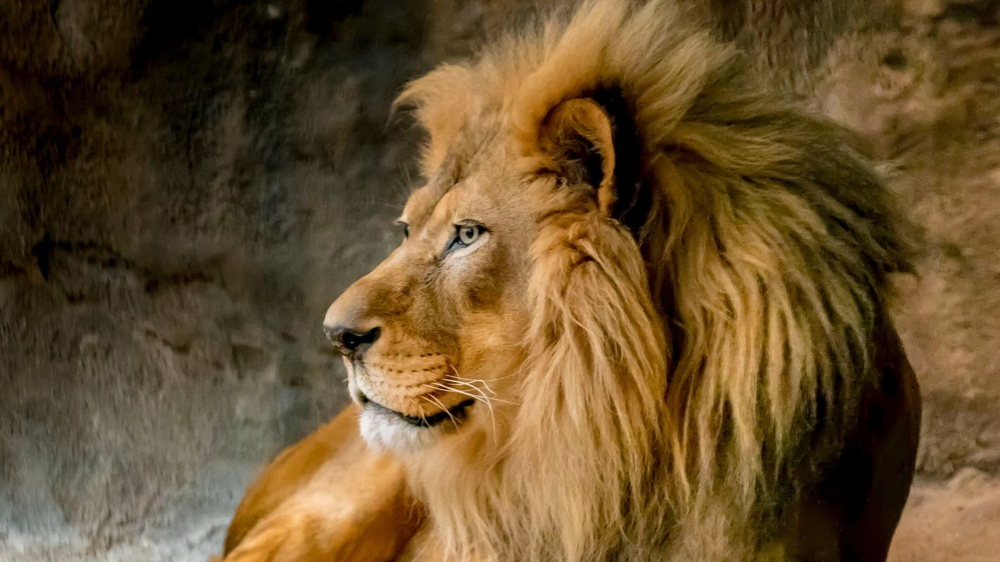

# African Lion Facts

The African lion is a massive, tawny colored predator of the cat family. On average, the lion is the tallest of the big cats, but the Siberian tiger tends to be considerably longer and heavier.
The ultimate apex predator and an awesomely beautiful creature, the adult male lion has a flamboyant  ruff of remarkably long hair around the head and neck known as a mane, which begins to develop when he is about 10 months old.
Although it has been speculated that the purpose of the mane is to provide protection in fights with other males, it is more likely an indication of fitness, condition and virility and it's color has been found to be linked to testosterone levels.
Lions with darker manes had more testosterone, and were found to be more appealing to female lions, and more intimidating to male opponents.
An adult male African lion is over 400 pounds and 4 feet tall at the shoulder. They are equipped with enormous fangs and incredibly powerful necks, forelimbs and claws that allow them to hunt, on average, the largest prey of any land animal.
Regularly taking down 600 pound plains zebras and 1,300 pound cape buffalo, African lions will also take on giraffes and even elephants in the right situation.
Compared to other cats, lions are very social animals and live in groups of 5 to 25 individuals called prides. The pride is made up of several related adult females, their cubs, and some adult males.
These pride males, often brothers, may come and go, and even be members of more than one pride at a time. They must continually prove themselves as established pride leaders, fending off all other males in serious, sometimes fatal fights.
The females hunt together, only occasionally being helped by the male members, but when the hunt is over, the adult males, generally 30 to 40 percent larger, eat first. 
Many adult male lions, however, live alone or in small "bachelor" groups, not bold enough or strong enough to take on established males. And pride leaders themselves, worn down from constant battles, will eventually succumb to a stronger rivals and retreat back to a solitary lifestyle.
African lions roam the grasslands and vast savannas of central and south Africa, The smaller, lighter colored Asiatic lion lives in the jungles of south Asia in very small numbers.
# African Lion Reproduction
The female lion is poly-estrus, which means she may ovulate up to 4 times a year until she is impregnated. When in estrus or "heat", she will pair up with a male of the pride for a few days during which time they will mate repeatedly.
Her pregnancy takes 3 1/2 to 4 months and when ready to deliver she will leave the pride to find a good nesting spot. She delivers 2 to 4 cubs and remains secluded with them for several weeks before returning to the pride and introducing the new members.
This is a dangerous time for mother and cubs, and she will usually fast for days while tending to her young. When she returns to the pride with the new cubs she is greeted with much nuzzling, inspecting and celebrating.
The cubs will be nurtured by the whole pride at this point, and if cubs are orphaned, another lioness will usually adopt them and even nurse them.
Female cubs will live with the pride their entire lives and never leave. Male cubs will leave the pride, usually driven off by the adult males, when they are about two years old. They will live alone, or band together in small groups of "bachelor" males called "coalitions" Many male lions will never return to a pride, and will never mate.
Only the strongest and boldest will attempt to takeover a pride by driving the established males out. Once a new male or new group of males take over, they will often - but not always- kill the youngest cubs in order to begin their own families.
The mothers are helpless against this, but in the life of a lioness this doesn't happen often. New males may come in every two years or so, and if the timing is right, the cubs may be old enough not to be harmed.
The main catalyst for the killing of the cubs appears to be an attempt to free up those mother lions to mate again, and, in fact, lionesses who lose their cubs for almost any reason will come back into heat very quickly.

